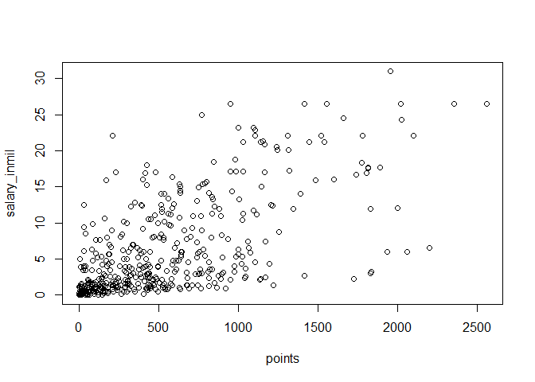
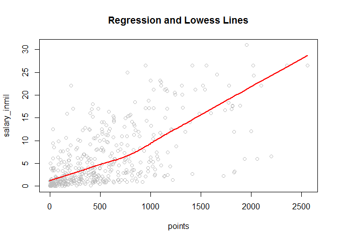
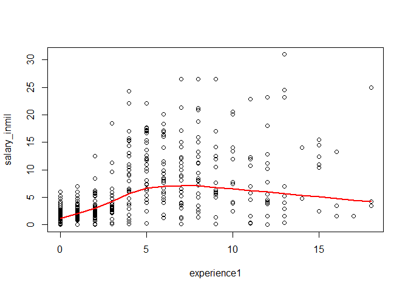
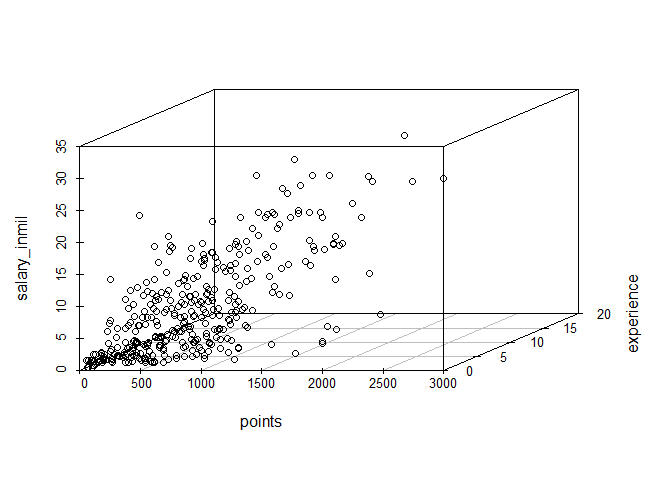
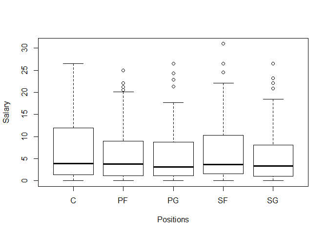

HW01
================

R Markdown
----------

This is an R Markdown document. Markdown is a simple formatting syntax for authoring HTML, PDF, and MS Word documents. For more details on using R Markdown see <http://rmarkdown.rstudio.com>.

When you click the **Knit** button a document will be generated that includes both content as well as the output of any embedded R code chunks within the document. You can embed an R code chunk like this:

``` r
summary(cars)
```

    ##      speed           dist       
    ##  Min.   : 4.0   Min.   :  2.00  
    ##  1st Qu.:12.0   1st Qu.: 26.00  
    ##  Median :15.0   Median : 36.00  
    ##  Mean   :15.4   Mean   : 42.98  
    ##  3rd Qu.:19.0   3rd Qu.: 56.00  
    ##  Max.   :25.0   Max.   :120.00

Including Plots
---------------

You can also embed plots, for example:


Note that the `echo = FALSE` parameter was added to the code chunk to prevent printing of the R code that generated the plot.

``` r
load("data/nba2017-salary-points.RData")
ls()
```

    ## [1] "experience" "player"     "points"     "points1"    "points2"   
    ## [6] "points3"    "position"   "salary"     "team"

``` r
 salary_in_mil=format(round(salary/1000000,2))

salary_inmil<-as.numeric(salary_in_mil)
salary_inmil
```

    ##   [1] 26.54 12.00  8.27  1.45  1.41  6.59  6.29  1.83  4.74  5.00  1.22
    ##  [12]  3.09  3.58  1.91  8.00  7.81  0.02  0.26  0.27  0.01  9.70 12.80
    ##  [23]  1.55  0.54 21.17  5.24 17.64 30.96  2.50 15.33  1.59  7.33  1.58
    ##  [34] 26.54 14.20  0.54  2.70 14.38 12.00  1.92  0.87  5.30  1.20  6.05
    ##  [45] 12.25  3.73 22.12  1.20  1.19  0.54 15.94  5.00 16.96 12.00  7.40
    ##  [56]  5.89  0.54  2.87  3.39  1.50  2.71 23.18  8.40  0.39 15.73  4.00
    ##  [67]  2.50  4.84  1.02 20.07  0.42  3.85  2.28  3.00 17.10  5.37  1.55
    ##  [78] 12.52 15.20  0.92  9.61  1.40 10.50  1.81  6.35  2.57  2.37  2.70
    ##  [89] 10.23  4.58  0.65  8.80  1.05  1.80  4.00  4.00 10.77  2.46 18.31
    ## [100]  1.05 14.15  3.49  1.45  2.11  0.87  2.09 23.20  1.02  1.64 17.55
    ## [111]  1.71  3.18  5.78  0.75 14.00 13.22  2.90 15.89 22.12  4.00  5.78
    ## [122]  0.87  2.59  1.23  0.21  0.54  5.63  4.00  6.00  1.02 22.12  6.50
    ## [133]  1.55  7.00  0.87  1.70  6.00 10.99  3.68  4.62  0.65  2.26 14.96
    ## [144]  2.97 17.20  1.05  0.10  0.87  5.32  2.73  6.51  0.16 12.00  6.33
    ## [155] 12.25 13.00 12.50 20.87  6.00  0.54 24.56  0.14 11.24 21.32 17.00
    ## [166]  1.02  4.32  3.90  6.19  0.54  0.54  2.90  0.54  1.41  1.38  4.35
    ## [177] 17.00  5.00  7.25  0.98  2.61 17.00 15.00  6.54  0.03  3.91 11.75
    ## [188]  0.03  0.95 10.00  0.03  2.32  9.00  4.79  9.42  4.83  1.51  2.99
    ## [199]  1.03  1.02  8.00  0.09  0.87  8.55  1.33  6.09  0.12 21.17  1.56
    ## [210]  1.07 11.48  0.98  3.00  3.33  1.79  2.50  1.40  0.98  0.73  9.25
    ## [221] 11.13  1.17  1.55 15.33  1.02  0.98  1.40 26.54  1.18 16.66  0.38
    ## [232]  0.54  5.78 12.11  2.90  0.54 10.00  1.55  0.54  1.18  2.90  0.17
    ## [243]  0.87 17.64  1.19 20.58 14.00  3.58 15.50 14.45  0.68  0.54  1.30
    ## [254] 12.39  0.26 26.54  0.54  7.00  1.00  6.00 18.74  1.72  7.81  0.15
    ## [265]  1.32 11.00 20.14  1.55  1.27 22.87 21.17  0.54  7.38 13.25  2.20
    ## [276]  1.40  3.50  1.55  5.63 10.15  7.00  3.94 11.05  8.00 16.07  1.02
    ## [287]  2.25 11.00  0.60  0.94  1.41  2.12  2.43  2.34  5.99  2.18  2.44
    ## [298]  2.48 17.15  0.98  1.19  4.84  3.75  0.25 26.54  0.54  3.14  8.95
    ## [309]  6.55  0.94  5.70 22.12  1.37  2.90  0.98  1.29 21.17 26.54  5.51
    ## [320]  3.33  4.26  1.79  0.08 10.36  7.68 18.50  3.22 24.33  6.67 16.39
    ## [331]  0.60  1.92  8.99  9.21  2.75  0.87  1.35  0.54 15.05  8.07  3.24
    ## [342]  1.66  3.21  4.54  1.99 12.08  1.63  2.33  3.50  1.36  5.00  3.53
    ## [353] 11.20  4.60 22.12  0.02  0.54  2.98 16.96  0.58  8.08  0.17 11.29
    ## [364]  9.90  0.06 11.24  2.09  0.65  1.02  4.23 25.00  0.54  8.38 22.12
    ## [375]  4.10  0.06  4.38  0.54  0.87  2.90 17.10  0.21  8.00 12.50  4.01
    ## [386]  3.52  5.23  8.00  2.20  8.05  5.20  1.44 13.33  1.19  1.32 10.66
    ## [397]  3.55  2.02  6.01  3.50  7.64  2.35  3.91  5.96  3.87  3.80  0.14
    ## [408] 13.55  3.05  1.34  2.24  5.28  7.60  5.33  0.07  1.03 12.50  3.27
    ## [419]  1.21 18.00  1.55  5.44  6.19  1.05 16.00  1.73  0.87  4.82 12.61
    ## [430]  0.54  2.22  4.28  0.02 14.00 10.47  4.00  2.94  0.28  2.13  0.92
    ## [441] 12.41

``` r
experience1<-as.integer(replace(experience,experience == 'R', "0"))
experience1
```

    ##   [1]  9 11  6  0  9  5  4  2  0  6  1  3  2  1  4 10 12 11  5  1  5 12 13
    ##  [24]  0  8 13  5 13 15  5  2  5  1  7  7  0  0  4 10  2  1  5  0  6  7  2
    ##  [47]  4  7  1  0  8  8  6  9  5  3  0  0  3  0  3 12  8 11  4 12  0 14  3
    ##  [70] 10  3 10  3  3  6  2 17  4  4  0  3  8  4  1  9  0  3  8 12 11  0  7
    ##  [93]  1  6  6  5 11  1  6  1  9  8  1  1  1  0 13  3  1  5  2  3  2  0 10
    ## [116]  8  4  8  4  7  9  1  1  6  0  0  2 13  7  1  4  4 12  1  1  0  6  5
    ## [139]  3  5  0  3  5  1  5  4  1  1  3  1  4  2  5  9 11  4  4  8  9  0 13
    ## [162]  0  8  7  9  3  1  4  5  0  0  0  0  9  0  2  5  9  8  2  2  4  8  7
    ## [185]  0  1  5  0  0  4  0  0  7  1  8  0  1  2  1  3  4  0  1  6  0  4  3
    ## [208]  8  0  0  6  2  2  2  4 10  1  2  2  6 12  0 13  4  3  2  8  9  1  5
    ## [231] 13  0 11  7 13  0  7 11  0  0  3  9  1  5  2 10 14  7 15 15  2  0  2
    ## [254]  8  0  7  0 11  1  4  8  1 12  0  7  4  6 11  0 11  8  0 10 16  8  8
    ## [277] 18 11  6  5 13  1  6  8  6  3  2 15  0  1  2  3  5  1  0  3  0  2  5
    ## [300]  2  1  4 12  5  8  0  3  7  3  0  8  5  0  2  2  1  8  9 12  3 18  0
    ## [323]  0 15  6  3  3  4  6  6  0  2  4  4  2  1  2  0  7  7  1  2  0 12  0
    ## [346]  5  0  3 16  1  8  4  8  6  4  1  0  7  6  4  5  4  7  6  0  3  2  0
    ## [369]  3 12 18  0  2  4 10  0  2  0  1  3  7  0  8  9  3  0  7  6  0  8  2
    ## [392]  0 10  0  7  7  1  2  2  8  6  3  7  1  0  1  7  5  3  1  2  0  9  1
    ## [415]  0  0  2  2  1 12 16  9  2  4  6  2  1  3  5  0  1  0  2  6  9 13  0
    ## [438] 11  2  0 15

``` r
position
```

    ##   [1] "C"  "PF" "SG" "PG" "SF" "PG" "SF" "SG" "SF" "PF" "PF" "C"  "SG" "PG"
    ##  [15] "C"  "C"  "SF" "PG" "PF" "C"  "SG" "SG" "SF" "PG" "PF" "SG" "PG" "SF"
    ##  [29] "SF" "C"  "SF" "SG" "PG" "SG" "SF" "PG" "C"  "C"  "PG" "C"  "SG" "SF"
    ##  [43] "PF" "PF" "PF" "SF" "SG" "PG" "PF" "C"  "C"  "C"  "PG" "C"  "PF" "SF"
    ##  [57] "SG" "SG" "PG" "SF" "PG" "C"  "PF" "PG" "SF" "PF" "PG" "SF" "C"  "PF"
    ##  [71] "PF" "SF" "SG" "SF" "C"  "PF" "SG" "C"  "SF" "SG" "PG" "PF" "PF" "SG"
    ##  [85] "PF" "C"  "SG" "PG" "C"  "SF" "PF" "PG" "PG" "PF" "SG" "PF" "SG" "C" 
    ##  [99] "SF" "PF" "PF" "SG" "PF" "PG" "C"  "SG" "SG" "SG" "PG" "SF" "C"  "PG"
    ## [113] "PF" "SF" "PG" "C"  "SG" "PG" "C"  "PF" "PF" "SG" "SF" "SF" "PF" "SG"
    ## [127] "PG" "C"  "SG" "C"  "C"  "C"  "PG" "C"  "SG" "PF" "PG" "PF" "SG" "SF"
    ## [141] "SG" "SF" "PG" "SF" "PF" "PG" "PG" "PF" "PF" "C"  "SG" "PF" "PG" "SG"
    ## [155] "PF" "SF" "C"  "SG" "PG" "SG" "SF" "PG" "SG" "PG" "C"  "SG" "PF" "C" 
    ## [169] "PF" "C"  "PF" "SF" "SG" "SG" "C"  "SF" "C"  "PG" "PG" "SF" "PG" "SG"
    ## [183] "PF" "SG" "SG" "SF" "C"  "SG" "C"  "SF" "PF" "PF" "SG" "C"  "PG" "C" 
    ## [197] "SF" "SG" "C"  "SF" "PG" "C"  "PG" "C"  "SF" "PF" "SG" "C"  "SF" "PG"
    ## [211] "PG" "SG" "C"  "SF" "PF" "SG" "SF" "SG" "PG" "PF" "SF" "C"  "C"  "PF"
    ## [225] "SG" "PF" "C"  "SF" "C"  "SG" "SF" "SG" "PG" "PG" "C"  "SG" "SG" "PF"
    ## [239] "PF" "PG" "C"  "C"  "SG" "SF" "SG" "PF" "SG" "PG" "C"  "PG" "PG" "C" 
    ## [253] "C"  "SG" "PG" "PG" "PF" "SG" "C"  "SG" "PF" "SF" "SF" "SF" "SF" "SG"
    ## [267] "PF" "PF" "PF" "PG" "C"  "C"  "SG" "SG" "SF" "C"  "SF" "PG" "SF" "SG"
    ## [281] "PF" "PG" "PF" "PG" "SF" "C"  "SF" "SF" "PF" "PG" "SG" "C"  "PG" "PF"
    ## [295] "SG" "SF" "PF" "SF" "C"  "SF" "PF" "SF" "PF" "PG" "PG" "PG" "C"  "PF"
    ## [309] "SG" "PG" "PF" "SF" "C"  "SF" "PF" "PF" "C"  "PG" "SG" "SG" "SF" "PG"
    ## [323] "SG" "PF" "SF" "SG" "SG" "PG" "PF" "SF" "SF" "C"  "SF" "PF" "PF" "SG"
    ## [337] "PG" "SG" "SF" "PF" "PG" "SG" "SG" "PG" "PF" "PF" "SG" "C"  "SF" "C" 
    ## [351] "C"  "SG" "SF" "C"  "C"  "SF" "PF" "SF" "C"  "PF" "SG" "SG" "PG" "C" 
    ## [365] "PG" "SF" "PG" "C"  "SG" "PG" "PF" "PF" "C"  "PF" "PG" "PF" "C"  "SF"
    ## [379] "C"  "PG" "SG" "PG" "PF" "SG" "SG" "SG" "PG" "SG" "C"  "C"  "PG" "SG"
    ## [393] "SF" "PF" "PG" "SF" "C"  "PF" "SF" "SG" "C"  "PF" "C"  "C"  "PG" "PF"
    ## [407] "SF" "PG" "SF" "PG" "SG" "SF" "SF" "PG" "SG" "C"  "SG" "PF" "PF" "SF"
    ## [421] "SF" "SG" "C"  "PF" "C"  "PG" "C"  "C"  "SG" "SF" "SG" "PF" "SG" "PG"
    ## [435] "PF" "SG" "PF" "PG" "SF" "PG" "C"

``` r
position_factor<-factor(position,
                               labels=c("center","power_fwd","point_guard","small_fwd","shoot_guard"))


position_factor
```

    ##   [1] center      power_fwd   shoot_guard point_guard small_fwd  
    ##   [6] point_guard small_fwd   shoot_guard small_fwd   power_fwd  
    ##  [11] power_fwd   center      shoot_guard point_guard center     
    ##  [16] center      small_fwd   point_guard power_fwd   center     
    ##  [21] shoot_guard shoot_guard small_fwd   point_guard power_fwd  
    ##  [26] shoot_guard point_guard small_fwd   small_fwd   center     
    ##  [31] small_fwd   shoot_guard point_guard shoot_guard small_fwd  
    ##  [36] point_guard center      center      point_guard center     
    ##  [41] shoot_guard small_fwd   power_fwd   power_fwd   power_fwd  
    ##  [46] small_fwd   shoot_guard point_guard power_fwd   center     
    ##  [51] center      center      point_guard center      power_fwd  
    ##  [56] small_fwd   shoot_guard shoot_guard point_guard small_fwd  
    ##  [61] point_guard center      power_fwd   point_guard small_fwd  
    ##  [66] power_fwd   point_guard small_fwd   center      power_fwd  
    ##  [71] power_fwd   small_fwd   shoot_guard small_fwd   center     
    ##  [76] power_fwd   shoot_guard center      small_fwd   shoot_guard
    ##  [81] point_guard power_fwd   power_fwd   shoot_guard power_fwd  
    ##  [86] center      shoot_guard point_guard center      small_fwd  
    ##  [91] power_fwd   point_guard point_guard power_fwd   shoot_guard
    ##  [96] power_fwd   shoot_guard center      small_fwd   power_fwd  
    ## [101] power_fwd   shoot_guard power_fwd   point_guard center     
    ## [106] shoot_guard shoot_guard shoot_guard point_guard small_fwd  
    ## [111] center      point_guard power_fwd   small_fwd   point_guard
    ## [116] center      shoot_guard point_guard center      power_fwd  
    ## [121] power_fwd   shoot_guard small_fwd   small_fwd   power_fwd  
    ## [126] shoot_guard point_guard center      shoot_guard center     
    ## [131] center      center      point_guard center      shoot_guard
    ## [136] power_fwd   point_guard power_fwd   shoot_guard small_fwd  
    ## [141] shoot_guard small_fwd   point_guard small_fwd   power_fwd  
    ## [146] point_guard point_guard power_fwd   power_fwd   center     
    ## [151] shoot_guard power_fwd   point_guard shoot_guard power_fwd  
    ## [156] small_fwd   center      shoot_guard point_guard shoot_guard
    ## [161] small_fwd   point_guard shoot_guard point_guard center     
    ## [166] shoot_guard power_fwd   center      power_fwd   center     
    ## [171] power_fwd   small_fwd   shoot_guard shoot_guard center     
    ## [176] small_fwd   center      point_guard point_guard small_fwd  
    ## [181] point_guard shoot_guard power_fwd   shoot_guard shoot_guard
    ## [186] small_fwd   center      shoot_guard center      small_fwd  
    ## [191] power_fwd   power_fwd   shoot_guard center      point_guard
    ## [196] center      small_fwd   shoot_guard center      small_fwd  
    ## [201] point_guard center      point_guard center      small_fwd  
    ## [206] power_fwd   shoot_guard center      small_fwd   point_guard
    ## [211] point_guard shoot_guard center      small_fwd   power_fwd  
    ## [216] shoot_guard small_fwd   shoot_guard point_guard power_fwd  
    ## [221] small_fwd   center      center      power_fwd   shoot_guard
    ## [226] power_fwd   center      small_fwd   center      shoot_guard
    ## [231] small_fwd   shoot_guard point_guard point_guard center     
    ## [236] shoot_guard shoot_guard power_fwd   power_fwd   point_guard
    ## [241] center      center      shoot_guard small_fwd   shoot_guard
    ## [246] power_fwd   shoot_guard point_guard center      point_guard
    ## [251] point_guard center      center      shoot_guard point_guard
    ## [256] point_guard power_fwd   shoot_guard center      shoot_guard
    ## [261] power_fwd   small_fwd   small_fwd   small_fwd   small_fwd  
    ## [266] shoot_guard power_fwd   power_fwd   power_fwd   point_guard
    ## [271] center      center      shoot_guard shoot_guard small_fwd  
    ## [276] center      small_fwd   point_guard small_fwd   shoot_guard
    ## [281] power_fwd   point_guard power_fwd   point_guard small_fwd  
    ## [286] center      small_fwd   small_fwd   power_fwd   point_guard
    ## [291] shoot_guard center      point_guard power_fwd   shoot_guard
    ## [296] small_fwd   power_fwd   small_fwd   center      small_fwd  
    ## [301] power_fwd   small_fwd   power_fwd   point_guard point_guard
    ## [306] point_guard center      power_fwd   shoot_guard point_guard
    ## [311] power_fwd   small_fwd   center      small_fwd   power_fwd  
    ## [316] power_fwd   center      point_guard shoot_guard shoot_guard
    ## [321] small_fwd   point_guard shoot_guard power_fwd   small_fwd  
    ## [326] shoot_guard shoot_guard point_guard power_fwd   small_fwd  
    ## [331] small_fwd   center      small_fwd   power_fwd   power_fwd  
    ## [336] shoot_guard point_guard shoot_guard small_fwd   power_fwd  
    ## [341] point_guard shoot_guard shoot_guard point_guard power_fwd  
    ## [346] power_fwd   shoot_guard center      small_fwd   center     
    ## [351] center      shoot_guard small_fwd   center      center     
    ## [356] small_fwd   power_fwd   small_fwd   center      power_fwd  
    ## [361] shoot_guard shoot_guard point_guard center      point_guard
    ## [366] small_fwd   point_guard center      shoot_guard point_guard
    ## [371] power_fwd   power_fwd   center      power_fwd   point_guard
    ## [376] power_fwd   center      small_fwd   center      point_guard
    ## [381] shoot_guard point_guard power_fwd   shoot_guard shoot_guard
    ## [386] shoot_guard point_guard shoot_guard center      center     
    ## [391] point_guard shoot_guard small_fwd   power_fwd   point_guard
    ## [396] small_fwd   center      power_fwd   small_fwd   shoot_guard
    ## [401] center      power_fwd   center      center      point_guard
    ## [406] power_fwd   small_fwd   point_guard small_fwd   point_guard
    ## [411] shoot_guard small_fwd   small_fwd   point_guard shoot_guard
    ## [416] center      shoot_guard power_fwd   power_fwd   small_fwd  
    ## [421] small_fwd   shoot_guard center      power_fwd   center     
    ## [426] point_guard center      center      shoot_guard small_fwd  
    ## [431] shoot_guard power_fwd   shoot_guard point_guard power_fwd  
    ## [436] shoot_guard power_fwd   point_guard small_fwd   point_guard
    ## [441] center     
    ## Levels: center power_fwd point_guard small_fwd shoot_guard

``` r
table(position_factor)
```

    ## position_factor
    ##      center   power_fwd point_guard   small_fwd shoot_guard 
    ##          89          89          85          83          95

``` r
plot(points,salary_inmil)
```



``` r
n<-length(player)
n
```

    ## [1] 441

``` r
x_mean=sum(points)/n
x_mean
```

    ## [1] 546.6054

``` r
y_mean=sum(salary)/n
y_mean
```

    ## [1] 6187014

``` r
var_x=1/(n-1)*sum((x_mean-points)^2)
var_x
```

    ## [1] 239136.2

``` r
var_y=1/(n-1)*sum((y_mean-salary)^2)
var_y
```

    ## [1] 4.318973e+13

``` r
sd_x=var_x^(1/2)
sd_x
```

    ## [1] 489.0156

``` r
sd_y=var_y^(1/2)
sd_y
```

    ## [1] 6571890

``` r
cov_xy=1/(n-1)*sum((x_mean-points)*(y_mean-salary))
cov_xy
```

    ## [1] 2046212512

``` r
cor_xy=cov_xy/sd_x/sd_y
cor_xy
```

    ## [1] 0.6367043

``` r
b1<-cor_xy*sd_y/sd_x
b1
```

    ## [1] 8556.681

``` r
b0<-y_mean-b1*x_mean
b0
```

    ## [1] 1509886

y\_hat&lt;-b0+b1\*x

``` r
y_hat=b0+b1*points
summary(y_hat)
```

    ##     Min.  1st Qu.   Median     Mean  3rd Qu.     Max. 
    ##  1509886  2844728  5206372  6187014  8184097 23397875

``` r
'y_hat=b0+b1x'
```

    ## [1] "y_hat=b0+b1x"

b1 means the how much the player would earn more if he scores one more point. b0 means how much the player earns if he scores 0 point

``` r
y_0=b0+b1*0
y_0
```

    ## [1] 1509886

``` r
y_100=b0+b1*100
y_100
```

    ## [1] 2365554

``` r
y_500=b0+b1*500
y_500
```

    ## [1] 5788226

``` r
y_1000=b0+b1*1000
y_1000
```

    ## [1] 10066566

``` r
y_2000=b0+b1*2000
y_2000
```

    ## [1] 18623247

``` r
plot(points, salary_inmil, col="grey", main = "Regression and Lowess Lines")
abline(y_mean-b1*x_mean ,cor_xy*(sd_y/sd_x), lwd = 2, col = "blue")
lines(lowess(points, salary_inmil), lwd=2,col= "red")
```



``` r
e_i<-salary-y_hat
e_i
```

    ##   [1]  16884254.217   6040640.331   -889895.295   -145452.451  -2341138.018
    ##   [6] -13738894.764  -3771601.781   -266539.939  -1173576.265    931666.792
    ##  [11]   -611386.514  -4217301.238  -5075834.127  -3111684.779   4967025.171
    ##  [16]    512769.123  -1568640.770  -2781905.510  -2576698.851  -1556080.728
    ##  [21]   3338476.333   8286719.390  -1087708.511  -2386823.659   9884059.862
    ##  [26]    537909.412    589244.990  12733810.037  -2843278.650   8429840.441
    ##  [31]    -40039.174   -511829.449  -1216107.766   7745719.103   7230951.995
    ##  [36]  -1881979.491   -217777.978   4666279.452  -1010064.664  -1753405.890
    ##  [41]  -6077298.644   2600735.723  -2273325.550    732391.393   7942079.729
    ##  [46]   -602937.313   5384529.180  -1002976.789   -326962.324  -1171774.983
    ##  [51]  12953962.575   -103691.587      3205.479   2934565.194  -3205637.354
    ##  [56]  -4814336.523  -1736515.917     43198.511   -561941.676   -874350.406
    ##  [61] -10900450.321  13096595.176   4579810.536  -1639365.173   7366551.021
    ##  [66]    291047.387  -2355547.843   1881535.299  -4216345.799   7900523.057
    ##  [71]  -1305574.663  -1459051.927  -9008566.819 -14190303.903   7452710.898
    ##  [76]  -4906163.482  -2585127.654   7653501.476  10044968.328  -7147859.831
    ##  [81]   3160409.524  -4624202.115   5131051.308   -913894.319   4128668.849
    ##  [86]   -875095.508  -4985771.642  -1565136.867   4142469.119  -3900130.510
    ##  [91]  -1039575.940  -3439963.390  -1039397.939  -1695035.593   2122177.082
    ##  [96]    975581.852   3869405.441  -9083032.244   1616537.903   -962387.811
    ## [101]   5678628.170   1627290.443  -3795475.161    140533.593  -3339160.782
    ## [106]  -1907679.761  12311992.179  -2042948.871  -3032817.546    503390.990
    ## [111]   -561710.236   -867693.846  -2093606.172  -2813489.039   7886620.076
    ## [116]   4530309.150  -4849705.960   1690556.702   9406169.165  -5852649.441
    ## [121]   3356999.509  -5247300.604   -593555.083  -3055250.228  -2137445.363
    ## [126]  -5219085.010  -4455679.824   2224857.252  -1054614.814  -3694388.269
    ## [131]  11151732.052   1866925.858  -1900593.189   3855788.321  -1722524.107
    ## [136]   -319166.492  -1995849.704   2919097.169  -6790411.460  -6340017.948
    ## [141]   -894112.366   -460733.638   7012012.381  -1440720.441   4386738.995
    ## [146]  -1673973.319  -1834821.684   -934733.472  -1659291.686  -6258424.679
    ## [151]   -157936.177  -1502422.898  -5168611.542  -1850763.682   3475492.342
    ## [156]   5132500.509  10724857.252   9399703.884   1820429.942  -1454145.450
    ## [161]   8853960.878  -2178910.321   2587285.873   9938954.692  13504964.407
    ## [166]  -5876341.878  -7425955.902  -1853999.329   2328027.132  -1308681.876
    ## [171]  -1804969.363  -2248474.991  -2806101.019  -1160316.064  -5157657.284
    ## [176]  -5877823.398  11357237.521   1085687.047    469198.973  -1231102.470
    ## [181]  -7846573.780   5504467.841   8030951.995   2232079.729  -1597710.174
    ## [186]   -312513.463    861992.179  -1477916.643   -756689.302   5931666.792
    ## [191]  -2025544.215  -8090553.695   1825591.655  -1769487.326   7631827.890
    ## [196]  -2048764.516  -1732731.849  -4985696.342  -5267239.221  -7887161.871
    ## [201]   1955073.523  -2686761.404  -5392764.178   6706403.805  -3990648.607
    ## [206]   4322406.932  -2203276.321   6487057.577  -3952132.266  -5082018.328
    ## [211]   5498224.289  -4191714.033  -2291938.565    745305.574  -1507329.934
    ## [216]  -2064620.695  -5890045.196  -8393044.316  -4479699.757   1673427.656
    ## [221]   4709947.567   -500902.578  -2662137.782   7180565.042  -5003560.435
    ## [226]  -1787286.723  -4145027.990  11724575.683  -1482197.554    247951.370
    ## [231]  -2101996.256  -3379398.634    944015.518  -6502331.600  -2257031.672
    ## [236]  -1770742.640   4237443.990  -4886874.795  -3559088.931  -1442174.149
    ## [241]  -1923321.120  -1557850.663  -4768126.479    -26836.029  -2422749.124
    ## [246]   8429165.099   8066310.374  -4425458.385   7213223.148   7476264.995
    ## [251]  -1359865.854  -1086208.174  -7213010.553    461997.800  -1280555.685
    ## [256]   4870674.347  -1077651.494   2555172.836  -5019256.435   -977604.686
    ## [261]   8848487.835  -4101892.776  -1711967.890  -1856173.130   -930312.193
    ## [266]   1883225.109   7370360.399  -2456777.442   -270192.366  11912366.733
    ## [271]  10850964.794  -1051981.451  -4169372.244   3117992.091  -3448319.159
    ## [276]  -6190074.705   1297023.211  -4561720.924   2526571.725   6223068.685
    ## [281]   2597956.240  -1094918.140   5467134.287   -603374.042    864008.366
    ## [286]  -1743465.043  -4231317.199   3372087.571  -1098132.621  -1427753.725
    ## [291]  -6503762.896  -9117543.734  -2755924.395  -2934225.203   1010865.945
    ## [296]  -3793401.030  -3168335.755   -267564.362   6796901.071  -4131817.268
    ## [301]   -438199.174   2574626.445   1957743.890  -1629831.918   3142224.822
    ## [306]  -2532287.233  -6113164.784   5668881.428  -4086904.077  -4201474.991
    ## [311]   2572901.682  18809961.385   -636944.130  -2282701.714  -6425007.727
    ## [316]  -1635577.978   7282828.893  12922510.998  -1506213.410  -2891676.774
    ## [321]  -2260043.603   -623133.810  -1897384.088     55291.475   1618925.161
    ## [326]   9759719.065 -14008929.307   5499817.379   3445445.193   9869342.397
    ## [331]  -1577306.747  -2189796.612    864564.084   4272369.349  -1556560.271
    ## [336]  -1473804.363  -2025122.061  -1231671.748   3742714.819   4318438.982
    ## [341]  -3427764.177  -7135741.020  -5238513.787  -2847800.366  -2132233.293
    ## [346]   5545994.716   -592770.151  -1277742.444   1750527.294 -10599092.923
    ## [351]   3455887.634  -4993030.915    132301.882   1318881.428   2646391.318
    ## [356]  -1583429.132  -1710845.874  -2253791.799  11905548.498  -2216663.766
    ## [361]    581800.784  -3621425.422    971807.794   7667290.487  -1890895.046
    ## [366]   4913921.056  -3390185.543  -1270606.322   -562643.089  -1021155.161
    ## [371]  16910026.807  -3961252.930   2449867.054   7617822.874   -673031.035
    ## [376]  -1788214.876   1265948.363  -2249916.766  -2457822.657  -6295785.018
    ## [381]   7153227.070  -4793213.417   2545484.500   6583423.735  -1736560.648
    ## [386]  -1227110.993  -3981444.380   2160433.863   -368674.064   2514974.372
    ## [391]   2714652.744   -745983.428   7014592.737  -2793926.400  -6021537.281
    ## [396]   7756661.384  -3186857.623    -26716.535 -12043349.666    304448.236
    ## [401]   5235641.871  -6143354.191   2298814.187 -13185044.811   -144473.123
    ## [406]  -1158228.013  -1756522.280   4886729.192  -5069344.235  -1958551.934
    ## [411]  -6875894.891  -2560149.449   4986302.531  -4596859.569  -2463159.341
    ## [416]  -2905026.996    679313.970  -6585529.441  -4144155.331  12853525.009
    ## [421]   -445957.450  -2834302.171   1403905.603  -2521084.720  11058885.349
    ## [426]  -1230641.382  -3595861.206  -1931509.985   6005139.270  -2403937.021
    ## [431] -14055116.737   1517158.957  -1512486.685    596328.019   5246514.882
    ## [436]  -1095134.906  -5011626.300  -1347084.174  -7518369.102  -4390682.927
    ## [441]   7508112.072

``` r
summary(e_i)
```

    ##      Min.   1st Qu.    Median      Mean   3rd Qu.      Max. 
    ## -14190304  -2793926  -1094918         0   2555173  18809961

``` r
RSS<-sum((salary-y_hat)^2)
RSS
```

    ## [1] 1.129962e+16

``` r
TSS<-sum((salary-y_mean)^2)
TSS
```

    ## [1] 1.900348e+16

``` r
R_2=1-RSS/TSS
R_2
```

    ## [1] 0.4053923

``` r
plot(experience1, salary_inmil)
lines(lowess(experience1, salary_inmil), lwd=2, col= "red")
```



``` r
require("scatterplot3d")
```

    ## Loading required package: scatterplot3d

``` r
scatterplot3d(points, experience, salary_inmil)
```

    ## Warning in xyz.coords(x = x, y = y, z = z, xlab = xlabel, ylab = ylabel, :
    ## NAs introduced by coercion



``` r
boxplot(salary_inmil ~ position, ylab = "Salary", xlab = "Positions")
```



From the scatterplots, does Experience seem to be related with Salary?
======================================================================

``` r
#The scattorplot3d definitely shows that 


#From the scatterplots, does Experience seem to be related with Salary?
#Not really, but players with little experience tend to have less salary. However, players who has a lot of experience don't seem to earn as much as players who are in the prime years (5-10) years of experience. 
#From the boxplot, does Position seem to be related with Salary?
#Not really, but more centers tend to have higher salary.
```

comments and reflections
========================

1.  To determine the types of data and when to use what type. I saw this in class, but when I did the hw I have to think about the when to use what type by myself.
2.  Calculations
3.  If this was my first time using git, then it was pretty hard for me
4.  I encountered many problems.
5.  Yes, I needed help. I searched on the Internet on how to use certain functions.
6.  I spent more than 10 hours. I accidentally didn't save the file once
7.  Figuring out what I did wrong that caused errors.
8.  Yes, my regression line is not showing up.
9.  I spent a lot of time trying to figure out why my regression line is not showing up
10. I found an error which is I made salary\_in\_mil a character and couldn't use it in the last part, so I had to convert it.
